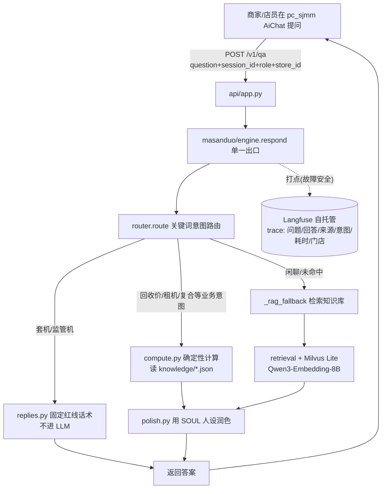
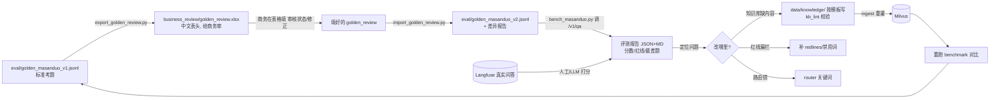
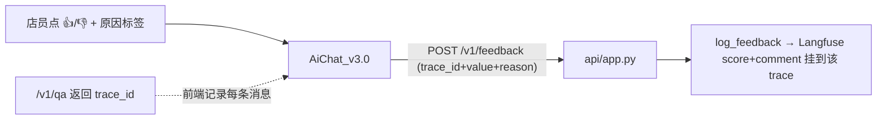

# 12 · 工作原理与闭环全景

> 给负责人的"一张图看懂"。分两部分：**A. 线上问答怎么运作**（运行时）；**B. 评测+知识治理闭环怎么运作**（迭代）。

## A. 线上问答运行时

要点：
- **单一出口** `engine.respond`：所有回答都从这里出，日志与 Langfuse 打点也在这里，排查/评测有唯一入口。
- **三条路**：红线固定话术（不进 LLM，最安全）/ 业务确定性计算（价格费率不靠 LLM 编）/ 检索兜底（知识库 + 大模型润色）。
- **Langfuse 打点是旁路**，失败也不影响回答。

## B. 评测 + 知识治理闭环

要点：**AI 是执行层；golden(标准) + 知识库(内容) 才是资产**。答错 → 报告定位 → 改知识库/红线/路由 → 重灌重跑 → 分数变好。

## C. 每个文件/脚本控制什么

### 线上问答（运行时，勿随意改）
| 文件 | 职责 |
|---|---|
| `api/app.py` | HTTP 入口，`/v1/qa` 收 question/session_id/role/store_id/user_id |
| `src/chatbot/masanduo/engine.py` | 编排单一出口：路由→计算/检索→润色→Langfuse 打点 |
| `src/chatbot/masanduo/router.py` | 关键词意图路由（红线优先） |
| `src/chatbot/masanduo/replies.py` | 红线固定话术（套机/监管机/转人工） |
| `src/chatbot/masanduo/compute.py` | 回收价/租机/复合等确定性计算（读 knowledge/*.json） |
| `src/chatbot/masanduo/polish.py` + `persona.py` + `SOUL.md` | 马三多人设与润色 |
| `src/chatbot/observability/langfuse_tracing.py` | 故障安全打点到 Langfuse |
| `src/chatbot/retrieval/` + `vectorstore/` + `embeddings/` | 检索、Milvus Lite、Qwen3-Embedding-8B |
| `data/target/知识库.md` | 当前线上实际 ingest 的知识源（历史单文件） |

### 评测与知识治理（工具，本阶段主要在这里干活）
| 文件 | 职责 |
|---|---|
| `eval/golden_masanduo_v1.jsonl` | 标准考题（54 题 10 类） |
| `eval/bench_masanduo.py` | 跑分：调 /v1/qa → 规则评分 → JSON+MD 报告 |
| `eval/forbidden_checker.py` | 禁用词/红线检查（否定感知） |
| `eval/judge_prompt.md` + `eval/judge.py` | LLM-as-judge（可选） |
| `eval/export_golden_review.py` | golden → 中文表头审核表（xlsx 带下拉+批注+字段说明页） |
| `scripts/import_golden_review.py` | 商务回填 → 合并回 v2 + 差异报告（认中/英表头，默认 dry-run） |
| `scripts/kb_lint.py` | 知识库 frontmatter 结构校验 |
| `scripts/prepare_business_review_pack.py` | 一键生成给商务的整套审核包 |
| `scripts/check_golden_review_roundtrip.py` | 导出↔导入闭环自测（改脚本后先跑它） |
| `data/knowledge/_templates/` | 7 类知识库模板（中文备注 frontmatter） |

## D. 后续怎么处理（标准流程）
1. `python scripts/prepare_business_review_pack.py` → 把 `business_review/` 发给商务。
2. 商务在 `golden_review.xlsx` 填**审核状态**（确认/修改/删除/待定/新增）。
3. 收回后 `import_golden_review.py`（先 dry-run 看报告 → `--write` 出 v2）。
4. `bench_masanduo.py --golden v2` 跑分，和 v1 对比。
5. 按报告改知识库(套模板+kb_lint)/红线/路由 → ingest → 重跑。
6. Langfuse 里人工/LLM 给真实问答打分，把新错题补进 golden。

## F. 前端反馈 + 结构化契约（2026-07-04 新增）

- **结构化契约**：`engine.respond_full()` 返回 `QaOutput{answer, sources, confidence(high/medium/low), need_human, trace_id, intent, path}`；`respond()` 仍返回字符串（向后兼容）。`/v1/qa` 追加可选字段 `sources/confidence/need_human`，并把 `trace_id` 换成 Langfuse 真实 trace id。
- **用户反馈闭环**：`/v1/feedback` 收前端富反馈 → `log_feedback()` 写 Langfuse score。

- confidence/need_human 派生：`:error`→low+转人工；`human_agent`→high+转人工；`chat:rag` 有来源→medium 否则 low+转人工；其余→high。

## E. 闭环还能怎么完善（下一步优先级）
- **P1 判分更准**：接 LLM-as-judge（judge.py 已备），替代规则粗评；`required_sources` 用 session_id 反查 Langfuse 的真实命中来源。
- **P1 反馈信号**：前端加 👍/👎 → 写 Langfuse score；Langfuse 建人工标注队列。
- **P1 知识库迁移**：把 `data/target/知识库.md` 拆进 `data/knowledge/` 治理结构，并切 ingest。
- **P2 自动化**：知识库改动 → 自动 kb_lint + ingest + benchmark 的一键流水线。
- **P2 结构化输出**：回答带 sources/confidence/need_human 契约。
