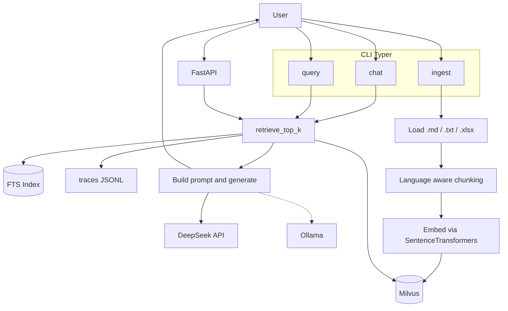
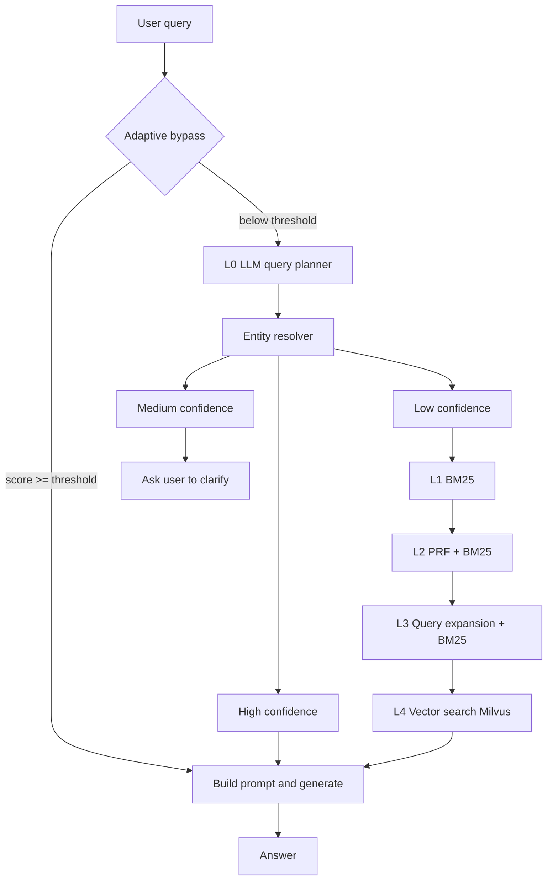
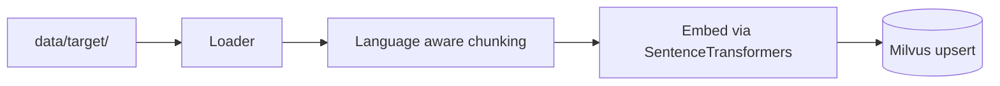

## Architecture report + workflow diagrams

English | [中文](intro.zh.md)

This repo is a **CLI-first RAG backend** that supports:

- **Ingest**: files (`.md`, `.txt`, `.xlsx`/`.xls`) → language-aware chunking → embeddings (SentenceTransformers / Ollama) → vectors in Milvus (default) or Qdrant
- **Query / Chat**: a multi-layer retrieval pipeline (adaptive planner + lexical + vector) → prompt → generation (DeepSeek API / Ollama)
- **HTTP API**: FastAPI server with synchronous and streaming (SSE) endpoints

Primary code lives in `src/chatbot/`.

---

### Repo map (what lives where)

- **CLI entrypoints** (`Typer`)
  - `src/chatbot/cli/ingest.py`: file ingest (`.md`, `.txt`, `.xlsx`/`.xls` → chunk → embed → upsert)
  - `src/chatbot/cli/ingest_sql.py`: SQL ingest (rows → row_to_text → embed → upsert)
  - `src/chatbot/cli/query.py`: one-shot RAG query (retrieve → prompt → generate)
  - `src/chatbot/cli/chat.py`: REPL chat loop (retrieve → prompt → generate) with UX branches
  - `src/chatbot/cli/entity_resolver.py`, `lexical.py`: CLI wrappers for resolver / lexical utilities
- **API server** (`FastAPI`)
  - `api/app.py`: HTTP endpoints (`/healthz`, `/readyz`, `POST /v1/qa`, `POST /v1/qa/stream`)
  - `api/models.py`: Pydantic request/response schemas
- **RAG orchestration**
  - `src/chatbot/rag/pipeline.py`: prompt builder and `rag_answer()`
  - `src/chatbot/service/qa_service.py`: shared QA entrypoint for CLI and API (retrieve → prompt → generate), including streaming
- **Retrieval stack**
  - `src/chatbot/retrieval/retriever.py`: `retrieve_top_k()` — the core retrieval ladder with adaptive planner bypass
  - `src/chatbot/retrieval/query_planner.py`: LLM planner → strict JSON plan → deterministic normalization
  - `src/chatbot/retrieval/entity_resolver.py`: SQLite FTS5 + RapidFuzz resolver (+ FTS index builder)
  - `src/chatbot/retrieval/bm25.py`, `prf.py`, `query_expansion.py`: lexical fallback layers (L1–L3)
  - `src/chatbot/retrieval/normalize.py`: deterministic query normalization utilities (used by planner/resolver)
  - `src/chatbot/retrieval/decompose.py`: query decomposition helpers
  - `src/chatbot/retrieval/lexical.py`: lexical lookup and normalization
- **Vector store**
  - `src/chatbot/vectorstore/milvus_store.py`: Milvus upsert/search wrapper (default provider)
  - `src/chatbot/vectorstore/qdrant_store.py`: Qdrant upsert/search wrapper (optional fallback)
  - `src/chatbot/vectorstore/base.py`: abstract vector store interface
  - `src/chatbot/vectorstore/ids.py`, `maintenance.py`, `milvus_filters.py`: ID generation, maintenance, Milvus filter builders
- **Model integrations**
  - `src/chatbot/embeddings/provider.py`: embedding provider abstraction (dispatches to Ollama or SentenceTransformers)
  - `src/chatbot/embeddings/ollama.py`: Ollama `/api/embeddings`
  - `src/chatbot/embeddings/st_embedder.py`: SentenceTransformers embedder (`BAAI/bge-m3` etc.)
  - `src/chatbot/llm/client.py`: provider-agnostic LLM client (routes to DeepSeek or Ollama; handles streaming + metrics)
  - `src/chatbot/llm/deepseek_chat.py`: DeepSeek / OpenAI-compatible API client
  - `src/chatbot/llm/ollama_chat.py`: Ollama `/api/generate`
- **Personas and prompts**
  - `src/chatbot/prompts/personas.py`: answer persona logic
  - `src/chatbot/config/personaPrompt.md`: persona prompt template
- **Configuration**
  - `src/chatbot/settings.py`: centralized `Settings` dataclass + `get_settings()` loader
  - `src/chatbot/config.py`: backward-compatible shim (re-exports `settings.py`)
  - `src/chatbot/config/budgets.py`: retrieval budget configuration
  - `.env.example`: env var template with defaults and comments
- **SQL adapters (for ingest + lexical contexts)**
  - `src/chatbot/sql/reader.py`, `row_to_doc.py`
- **Ingest**
  - `src/chatbot/ingest/loader.py`: file loading (`.md`, `.txt`, `.xlsx`/`.xls`); Excel rows are converted to key-value text
  - `src/chatbot/ingest/chunking.py`: language-aware chunking (English + Chinese)
  - `src/chatbot/ingest/dedup.py`: deduplication logic
- **Observability**
  - `src/chatbot/observability/metrics.py`: per-query `MetricsRecorder` (writes JSONL into `./traces/`)
  - `src/chatbot/observability/writer.py`: trace writer
  - `src/chatbot/observability/logging.py`: structured logging
  - `src/chatbot/observability/decorators.py`: timing/tracing decorators
- **Deployment**
  - `Dockerfile`: API image (pre-downloads `BAAI/bge-m3`, runs uvicorn)
  - `docker-compose.yml`: local dev stack (etcd + MinIO + Milvus + Ollama GPU + API)
  - `deploy/docker-compose.yml`: production stack (no Ollama; API + Milvus)
  - `deploy/milvus-values.yaml`: Helm values for Milvus on K8s
  - `k8s/api/`, `k8s/dev/`: Kubernetes manifests (deployments, services, configmaps, secrets, ingress, bootstrap jobs)
- **CI/CD** (`.github/workflows/`)
  - `test-build.yml`: lint + Docker image build on PR
  - `deploy.yml`: build → push to GHCR → deploy to ECS
  - `reingest-ecs.yml`: trigger remote data re-ingestion
  - `ci-kind-smoke.yaml`: spin up kind cluster and run smoke tests
- **Utility / scripts**
  - `Makefile`: common commands (`make install`, `make chat`, `make query`, `make ingest`, `make api`, K8s targets, clean targets)
  - `chatbot` (root): convenience wrapper for `python -m chatbot.cli.chat`
  - `scripts/upload_data_to_ecs.sh`: upload `data/target/*` to ECS server for remote ingestion
  - `scripts/bootstrap_collection.py`: create/bootstrap vector collection
  - `scripts/bench_embed.py`: embedding latency benchmark
  - `eval/`: offline retrieval evaluation (Recall@k, MRR) for BM25/PRF/QExp
  - `tests/`: connectivity checks + retrieval/resolver unit tests

---

### Architecture layers (runtime)

This is the **current, in-code layering** from "user input" to "answer".

- **L-1 Interface**
  - CLI (`Typer`) commands: `chat`, `query`, `ingest`, `ingest_sql`
  - HTTP API (`FastAPI`): `POST /v1/qa`, `POST /v1/qa/stream` (SSE)
- **Adaptive planner bypass** (runs before L0 when the LLM planner is enabled)
  - Performs a quick speculative vector search using a deterministic plan
  - If the top result score exceeds a threshold, the expensive LLM planner is skipped entirely and retrieval proceeds with the speculative results
- **L0 Planning** (only reached if the adaptive bypass did not short-circuit)
  - `plan_query()` uses the LLM (DeepSeek API or Ollama) to emit a **strict JSON plan**:
    - intent (`entity_lookup|semantic|mixed`)
    - lexical query + vector query
    - preferred tables + filter hints (e.g. `{"table": ["Track"]}`)
  - On any failure: deterministic fallback plan + deterministic post-processing normalization
- **Lexical resolution (entity resolver)**
  - `resolve_entity()` uses a separate SQLite **FTS5 index DB** (derived as `*_fts.sqlite`)
  - Candidate retrieval by FTS `MATCH` (phrase + fallback queries) + fuzzy reranking (RapidFuzz)
  - Decisions:
    - **high**: fetch row(s) from SQL DB and return row-to-text contexts (skips vector search)
    - **medium**: return "Did you mean…?" suggestions (chat CLI shows suggestions and stops)
    - **low**: proceed to fallback retrieval and/or vector search
- **L1–L3 Lexical fallback layers (when resolver is low)**
  - L1: BM25
  - L2: PRF (pseudo relevance feedback) + BM25
  - L3: deterministic query expansion + BM25
- **L4 Vector retrieval**
  - Embed selected query text via SentenceTransformers (default) or Ollama
  - Milvus search (default) or Qdrant search, with optional `table` filter (from planner)
- **Generation (RAG)**
  - Build prompt with retrieved contexts (with optional answer persona) and generate via DeepSeek API (default) or Ollama
  - Supports streaming (SSE) via the API and CLI
  - Chat CLI has extra UX behavior for "medium resolver" and "low-with-vector" cases
- **Observability**
  - `MetricsRecorder` records per-level timings (L0–L4, LLM generation, TTFB) and writes to `./traces/`

Notes:

- `src/chatbot/cache/tiered_cache.py` exists but is **not currently used** in retrieval/ingest.
- Feature flags `ENABLE_BM25_LAYER`, `ENABLE_PRF_LAYER`, `ENABLE_QEXP_LAYER` are defined in settings but L1–L3 currently run unconditionally when the fallback path is reached.

---

### Workflow diagram (system overview)

---

### Workflow diagram (query/chat retrieval ladder)

This diagram matches `src/chatbot/retrieval/retriever.py` and `src/chatbot/cli/chat.py`.

---

### Workflow diagram (ingest)

---

### Runtime configuration (env)

All config is loaded via `.env` / environment variables in `src/chatbot/settings.py`. See `.env.example` for the full template.

- **Milvus** (default): `MILVUS_URI`, `MILVUS_LITE_DB`, `MILVUS_DB`, `MILVUS_COLLECTION`
- **Qdrant** (optional fallback): `QDRANT_URL`, `QDRANT_API_KEY`, `QDRANT_COLLECTION`
- **Vector provider**: `VECTOR_PROVIDER` (`milvus` | `qdrant`)
- **Embeddings**: `EMBED_PROVIDER` (`sentence_transformers` | `ollama`), `EMBED_MODEL`, `EMBED_DIM`
- **LLM**: `LLM_PROVIDER` (`deepseek` | `ollama`), `API_KEY`, `API_BASE_URL`, `MODEL_NAME`, `LLM_TEMPERATURE`, `LLM_MAX_TOKENS`
- **Ollama** (when used): `OLLAMA_BASE_URL`, `CHAT_MODEL`
- **Retrieval**: `TOP_K_DEFAULT`, `ENABLE_QUERY_PLANNER`, `ENABLE_LEGACY_TRAILING_TRIM`
- **Feature flags**: `ENABLE_BM25_LAYER`, `ENABLE_PRF_LAYER`, `ENABLE_QEXP_LAYER`
- **Persona**: `ANSWER_PERSONA` (`none` | `phone_mom`)
- **SQL ingest / resolver**: `DB_URI`, `SQL_TABLE`, `SQL_UPDATED_AT`, `SQL_PK`
- **Observability**: `OBS_METRICS_ENABLED`, `SLA_P95_LATENCY_MS`, `DEBUG_TRACES`

---

### How to "read" a query execution

If you run `chat` or `query` with `--debug`, you'll typically see:

- **PLANNER_CONFIG**: LLM provider, model, and whether the adaptive bypass triggered
- **QUERY_PLAN**: the normalized plan output of L0 (or the deterministic plan if bypass/fallback was used)
- **Resolver logs**: FTS candidates and a decision (high/medium/low)
- **Fallback logs**: whether BM25/PRF/QExp returned hits
- **Vector search logs**: exact embedded text + optional filters + top results

Metrics are written as JSONL into `./traces/` when `OBS_METRICS_ENABLED=true`.
