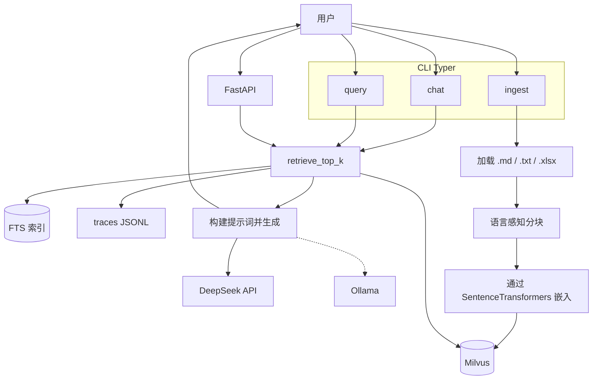
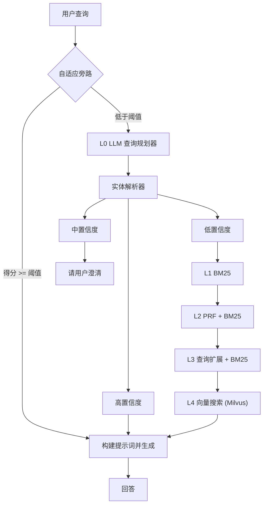
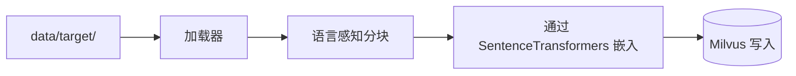

## 架构说明 + 工作流图

[English](intro.md) | 中文

本仓库是一个 **CLI 优先的 RAG 后端**，支持：

- **数据导入**：文件（`.md`、`.txt`、`.xlsx`/`.xls`）→ 语言感知分块 → Embeddings（SentenceTransformers / Ollama）→ 向量存入 Milvus（默认）或 Qdrant
- **查询 / 聊天**：多层检索管道（自适应规划器 + 词汇匹配 + 向量搜索）→ 提示词构建 → 生成（DeepSeek API / Ollama）
- **HTTP API**：FastAPI 服务器，提供同步和流式（SSE）接口

核心代码位于 `src/chatbot/`。

---

### 仓库结构（各模块位置）

- **CLI 入口**（`Typer`）
  - `src/chatbot/cli/ingest.py`：文件导入（`.md`、`.txt`、`.xlsx`/`.xls` → 分块 → 嵌入 → 写入）
  - `src/chatbot/cli/ingest_sql.py`：SQL 导入（行 → row_to_text → 嵌入 → 写入）
  - `src/chatbot/cli/query.py`：单次 RAG 查询（检索 → 构建提示词 → 生成）
  - `src/chatbot/cli/chat.py`：REPL 聊天循环（检索 → 构建提示词 → 生成），包含 UX 分支逻辑
  - `src/chatbot/cli/entity_resolver.py`、`lexical.py`：实体解析 / 词汇工具的 CLI 封装
- **API 服务器**（`FastAPI`）
  - `api/app.py`：HTTP 接口（`/healthz`、`/readyz`、`POST /v1/qa`、`POST /v1/qa/stream`）
  - `api/models.py`：Pydantic 请求/响应模型
- **RAG 编排**
  - `src/chatbot/rag/pipeline.py`：提示词构建器和 `rag_answer()`
  - `src/chatbot/service/qa_service.py`：CLI 和 API 共享的 QA 入口（检索 → 构建提示词 → 生成），包含流式支持
- **检索栈**
  - `src/chatbot/retrieval/retriever.py`：`retrieve_top_k()` — 核心检索梯度，带自适应规划器旁路
  - `src/chatbot/retrieval/query_planner.py`：LLM 规划器 → 严格 JSON 计划 → 确定性归一化
  - `src/chatbot/retrieval/entity_resolver.py`：SQLite FTS5 + RapidFuzz 实体解析器（+ FTS 索引构建器）
  - `src/chatbot/retrieval/bm25.py`、`prf.py`、`query_expansion.py`：词汇回退层（L1–L3）
  - `src/chatbot/retrieval/normalize.py`：确定性查询归一化工具（供规划器/解析器使用）
  - `src/chatbot/retrieval/decompose.py`：查询分解辅助函数
  - `src/chatbot/retrieval/lexical.py`：词汇查找和归一化
- **向量存储**
  - `src/chatbot/vectorstore/milvus_store.py`：Milvus 写入/搜索封装（默认提供商）
  - `src/chatbot/vectorstore/qdrant_store.py`：Qdrant 写入/搜索封装（可选备用）
  - `src/chatbot/vectorstore/base.py`：抽象向量存储接口
  - `src/chatbot/vectorstore/ids.py`、`maintenance.py`、`milvus_filters.py`：ID 生成、维护、Milvus 过滤器构建器
- **模型集成**
  - `src/chatbot/embeddings/provider.py`：Embedding 提供商抽象层（分发到 Ollama 或 SentenceTransformers）
  - `src/chatbot/embeddings/ollama.py`：Ollama `/api/embeddings`
  - `src/chatbot/embeddings/st_embedder.py`：SentenceTransformers 嵌入器（`BAAI/bge-m3` 等）
  - `src/chatbot/llm/client.py`：提供商无关的 LLM 客户端（路由到 DeepSeek 或 Ollama；支持流式 + 指标采集）
  - `src/chatbot/llm/deepseek_chat.py`：DeepSeek / OpenAI 兼容 API 客户端
  - `src/chatbot/llm/ollama_chat.py`：Ollama `/api/generate`
- **人设与提示词**
  - `src/chatbot/prompts/personas.py`：回答人设逻辑
  - `src/chatbot/config/personaPrompt.md`：人设提示词模板
- **配置**
  - `src/chatbot/settings.py`：集中式 `Settings` 数据类 + `get_settings()` 加载器
  - `src/chatbot/config.py`：向后兼容的垫片（重新导出 `settings.py`）
  - `src/chatbot/config/budgets.py`：检索预算配置
  - `.env.example`：环境变量模板（含默认值和注释）
- **SQL 适配器（用于导入 + 词汇上下文）**
  - `src/chatbot/sql/reader.py`、`row_to_doc.py`
- **数据导入**
  - `src/chatbot/ingest/loader.py`：文件加载（`.md`、`.txt`、`.xlsx`/`.xls`）；Excel 行被转换为键值对文本
  - `src/chatbot/ingest/chunking.py`：语言感知分块（英文 + 中文）
  - `src/chatbot/ingest/dedup.py`：去重逻辑
- **可观测性**
  - `src/chatbot/observability/metrics.py`：每次查询的 `MetricsRecorder`（写入 JSONL 到 `./traces/`）
  - `src/chatbot/observability/writer.py`：Trace 写入器
  - `src/chatbot/observability/logging.py`：结构化日志
  - `src/chatbot/observability/decorators.py`：计时/追踪装饰器
- **部署**
  - `Dockerfile`：API 镜像（预下载 `BAAI/bge-m3`，运行 uvicorn）
  - `docker-compose.yml`：本地开发栈（etcd + MinIO + Milvus + Ollama GPU + API）
  - `deploy/docker-compose.yml`：生产栈（无 Ollama；API + Milvus）
  - `deploy/milvus-values.yaml`：K8s 上 Milvus 的 Helm values
  - `k8s/api/`、`k8s/dev/`：Kubernetes 清单文件（deployments、services、configmaps、secrets、ingress、bootstrap jobs）
- **CI/CD**（`.github/workflows/`）
  - `test-build.yml`：PR 时执行 lint + Docker 镜像构建
  - `deploy.yml`：构建 → 推送到 GHCR → 部署到 ECS
  - `reingest-ecs.yml`：触发远程数据重新导入
  - `ci-kind-smoke.yaml`：启动 kind 集群并运行冒烟测试
- **工具 / 脚本**
  - `Makefile`：常用命令（`make install`、`make chat`、`make query`、`make ingest`、`make api`、K8s 目标、清理目标）
  - `chatbot`（根目录）：`python -m chatbot.cli.chat` 的便捷封装
  - `scripts/upload_data_to_ecs.sh`：上传 `data/target/*` 到 ECS 服务器以进行远程导入
  - `scripts/bootstrap_collection.py`：创建/初始化向量集合
  - `scripts/bench_embed.py`：Embedding 延迟基准测试
  - `eval/`：离线检索评估（Recall@k、MRR），用于 BM25/PRF/QExp
  - `tests/`：连通性检查 + 检索/解析器单元测试

---

### 架构层次（运行时）

以下是从"用户输入"到"回答"的**当前代码分层**。

- **L-1 接口层**
  - CLI（`Typer`）命令：`chat`、`query`、`ingest`、`ingest_sql`
  - HTTP API（`FastAPI`）：`POST /v1/qa`、`POST /v1/qa/stream`（SSE）
- **自适应规划器旁路**（在 LLM 规划器启用时，于 L0 之前运行）
  - 使用确定性计划进行快速投机向量搜索
  - 如果最高结果得分超过阈值，则跳过昂贵的 LLM 规划器，直接使用投机搜索结果继续检索
- **L0 规划层**（仅在自适应旁路未短路时到达）
  - `plan_query()` 使用 LLM（DeepSeek API 或 Ollama）输出**严格 JSON 计划**：
    - intent（`entity_lookup|semantic|mixed`）
    - 词汇查询 + 向量查询
    - 偏好表 + 过滤提示（例如 `{"table": ["Track"]}`）
  - 任何失败时：回退到确定性计划 + 确定性后处理归一化
- **词汇解析（实体解析器）**
  - `resolve_entity()` 使用独立的 SQLite **FTS5 索引数据库**（派生为 `*_fts.sqlite`）
  - 通过 FTS `MATCH` 检索候选项（短语 + 回退查询）+ 模糊重排序（RapidFuzz）
  - 决策：
    - **高置信度**：从 SQL 数据库获取行并返回 row-to-text 上下文（跳过向量搜索）
    - **中置信度**：返回"你是不是想找……？"建议（聊天 CLI 显示建议并停止）
    - **低置信度**：继续回退检索和/或向量搜索
- **L1–L3 词汇回退层（当解析器为低置信度时）**
  - L1：BM25
  - L2：PRF（伪相关反馈）+ BM25
  - L3：确定性查询扩展 + BM25
- **L4 向量检索**
  - 通过 SentenceTransformers（默认）或 Ollama 对选定查询文本进行嵌入
  - Milvus 搜索（默认）或 Qdrant 搜索，支持可选的 `table` 过滤器（来自规划器）
- **生成（RAG）**
  - 使用检索到的上下文（可选回答人设）构建提示词，通过 DeepSeek API（默认）或 Ollama 生成
  - 通过 API 和 CLI 支持流式（SSE）
  - 聊天 CLI 对"中置信度解析器"和"低置信度+向量"场景有额外的 UX 行为
- **可观测性**
  - `MetricsRecorder` 记录各层耗时（L0–L4、LLM 生成、TTFB）并写入 `./traces/`

备注：

- `src/chatbot/cache/tiered_cache.py` 存在但**当前未在检索/导入中使用**。
- 功能开关 `ENABLE_BM25_LAYER`、`ENABLE_PRF_LAYER`、`ENABLE_QEXP_LAYER` 已在 settings 中定义，但 L1–L3 在进入回退路径时目前无条件运行。

---

### 工作流图（系统总览）

---

### 工作流图（查询/聊天检索梯度）

此图对应 `src/chatbot/retrieval/retriever.py` 和 `src/chatbot/cli/chat.py`。

---

### 工作流图（数据导入）

---

### 运行时配置（环境变量）

所有配置通过 `.env` / 环境变量在 `src/chatbot/settings.py` 中加载。完整模板请参阅 `.env.example`。

- **Milvus**（默认）：`MILVUS_URI`、`MILVUS_LITE_DB`、`MILVUS_DB`、`MILVUS_COLLECTION`
- **Qdrant**（可选备用）：`QDRANT_URL`、`QDRANT_API_KEY`、`QDRANT_COLLECTION`
- **向量提供商**：`VECTOR_PROVIDER`（`milvus` | `qdrant`）
- **Embeddings**：`EMBED_PROVIDER`（`sentence_transformers` | `ollama`）、`EMBED_MODEL`、`EMBED_DIM`
- **LLM**：`LLM_PROVIDER`（`deepseek` | `ollama`）、`API_KEY`、`API_BASE_URL`、`MODEL_NAME`、`LLM_TEMPERATURE`、`LLM_MAX_TOKENS`
- **Ollama**（使用时）：`OLLAMA_BASE_URL`、`CHAT_MODEL`
- **检索**：`TOP_K_DEFAULT`、`ENABLE_QUERY_PLANNER`、`ENABLE_LEGACY_TRAILING_TRIM`
- **功能开关**：`ENABLE_BM25_LAYER`、`ENABLE_PRF_LAYER`、`ENABLE_QEXP_LAYER`
- **人设**：`ANSWER_PERSONA`（`none` | `phone_mom`）
- **SQL 导入 / 解析器**：`DB_URI`、`SQL_TABLE`、`SQL_UPDATED_AT`、`SQL_PK`
- **可观测性**：`OBS_METRICS_ENABLED`、`SLA_P95_LATENCY_MS`、`DEBUG_TRACES`

---

### 如何"阅读"一次查询执行

如果使用 `--debug` 运行 `chat` 或 `query`，你通常会看到：

- **PLANNER_CONFIG**：LLM 提供商、模型，以及自适应旁路是否触发
- **QUERY_PLAN**：L0 的归一化计划输出（或旁路/回退时使用的确定性计划）
- **Resolver 日志**：FTS 候选项和决策（高/中/低）
- **Fallback 日志**：BM25/PRF/QExp 是否返回了结果
- **Vector search 日志**：实际嵌入的文本 + 可选过滤器 + 最优结果

当 `OBS_METRICS_ENABLED=true` 时，指标以 JSONL 格式写入 `./traces/`。
